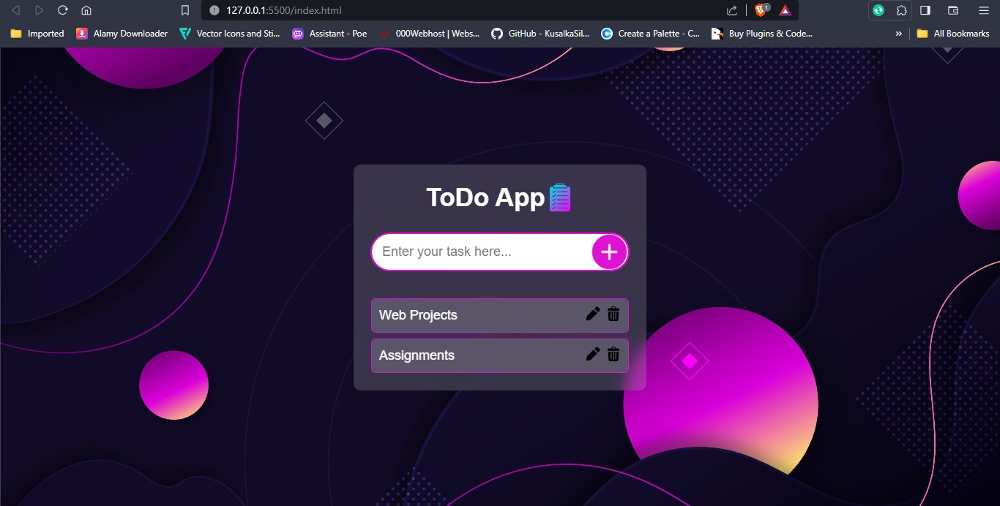
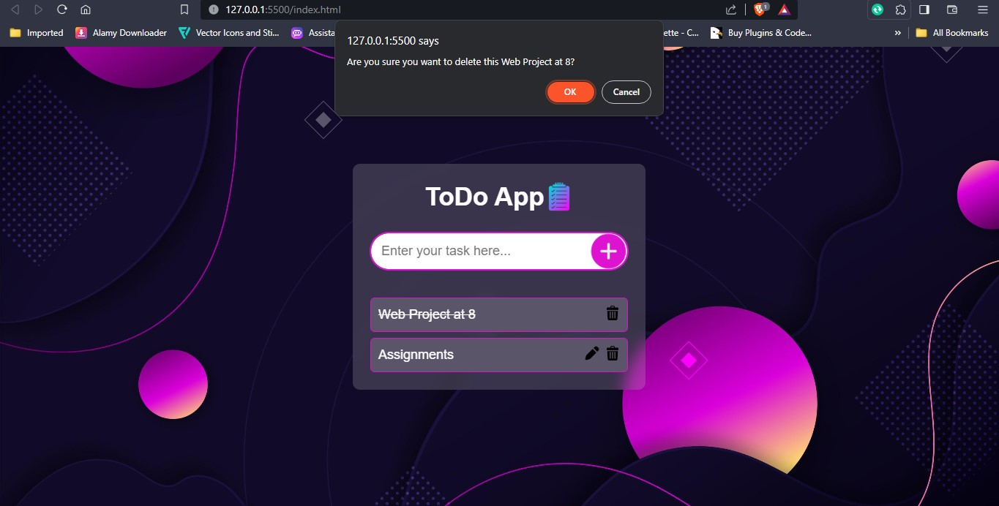

# Simple-To-do-WebApp

💻 Technologies Used:

- HTML (For Structure)
- CSS (For Design and UI/UX)
- JavaScript (Functionality)
- ✅ Implemented CRUD operations
- 🔄 Utilized Local Storage for seamless data persistence

- Some Images

 
